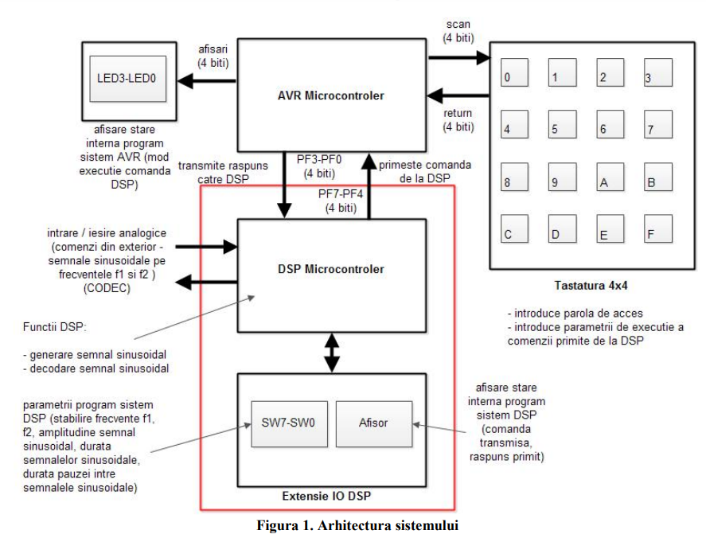
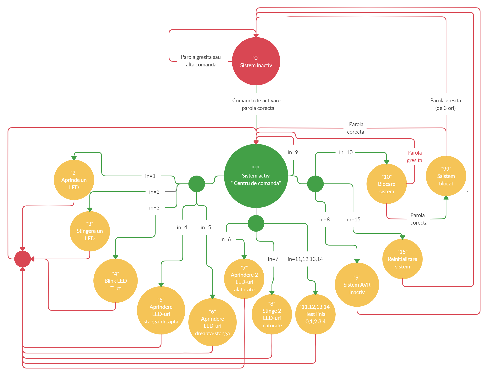
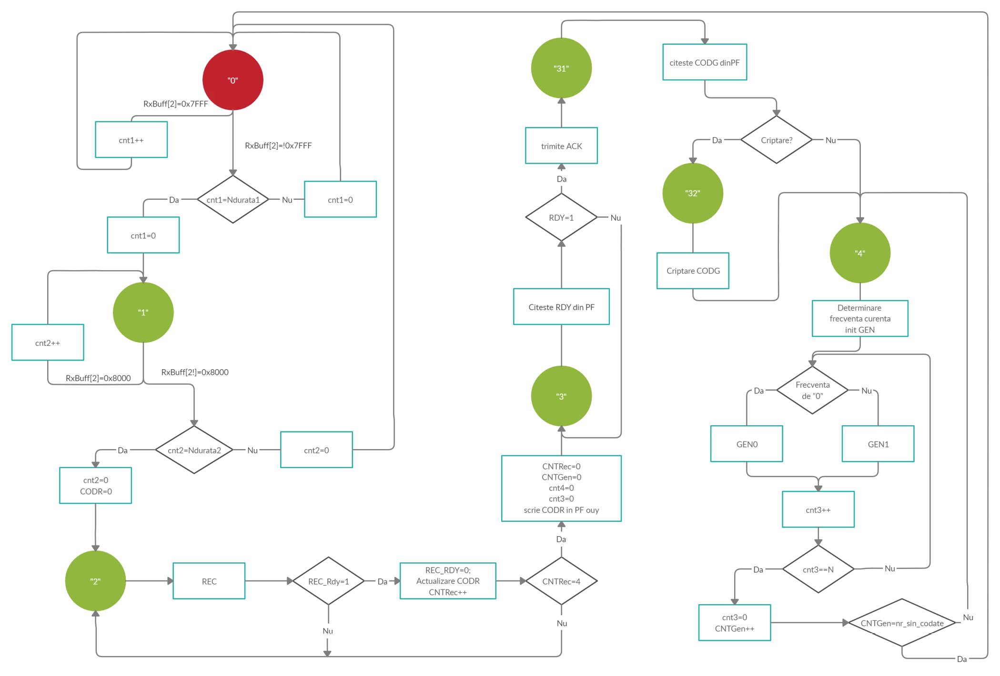
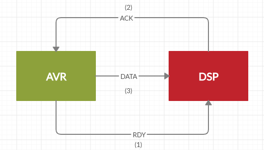
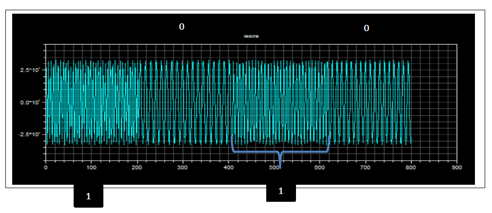
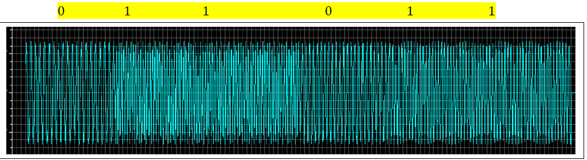
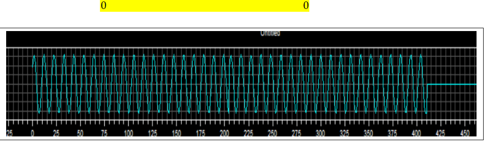
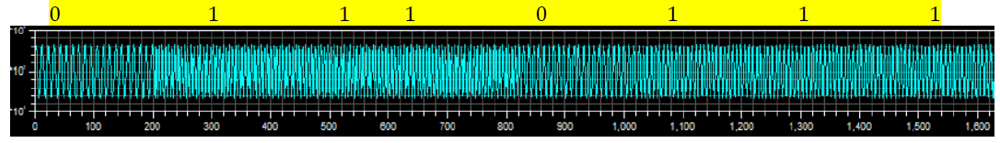

#[proiect_2]

Sistemul este compus din doua microcontrolere (AVR si DSP) care comunica intre ele printr-un
port paralel (PF) de 8 biti. Microcontrolerul DSP preia de la un sistem extern comenzi sub forma unor
semnale sinusoidale (de la un convertor analog digital). Aceste comenzi sint decodificate intr-un semnal
binar care este transmis pe portul PF catre microcontrolerul AVR. Microcontrolerul AVR executa
comanda si transmite un raspuns catre microcontrolerul DSP pe acelasi port PF. Microcontrolerul DSP
converteste raspunsul primit intr-un semnal binar si il transmite catre sistemul extern (prin intermedul
unui convertor digital analog). Ambele subsisteme isi afiseaza starea proprie (pe LED3-LED0, respectiv pe
un afisor cu 7 segmente – Afisor). Subsistemul AVR are o tastatura prin care poate sa isi seteze
parametri de executie a comenzii. Subsistemul DSP poate sa isi seteze parametrii (frecventele f1 si f2,
durata (T) si amplitudinea (A) semnalelor sinusoidale, durata pauzei (P)) de la 8 butoane SW7-SW0.
Subsistemul DSP are in componenta placa de evaluare EZ-Kit LITE ADSP2181 si o interfata de intrare
iesire (IO DSP)

##Graf proces secvential AVR 

##Graf proces secvential  DSP

##Diagrama alg. Goertzel (pentru decodare Tonurilor)

##Diagrama comunicatie 

##Capturi din simulari
1. Rezulatul iesirii dupa ce dam fill from file din fisierul (sgn_out):
    Frecventa mai mare -> “1” Frecventa mai mica -> “0”

2. Exemple in urma codarii mai multor rezultate:
  
1010-> 011011

0000-> 00

1111-> 01110111

